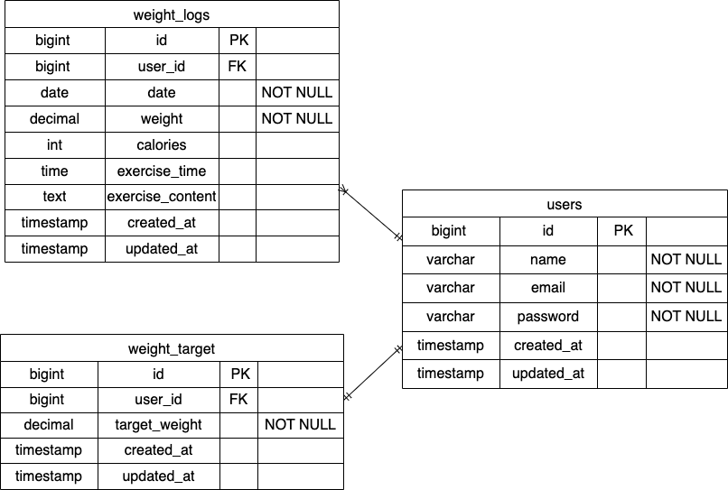

# PiGly
# 環境構築
## Dockerビルド
1. git clone git@github.com:git@github.com:uedarina24-hue/PIGLY
2. cd coachtech-Checktest-mogitate
3. DockerDesktopアプリを立ち上げる
4. docker-compose up -d --build

## Laravel環境構築
1. docker-compose exec php bash
2. composer install
3. 「.env.example」ファイルを 「.env」ファイルに命名を変更。または、新しく.envファイルを作成
4. .envに以下の環境変数を追加
    * DB_CONNECTION=mysql
    * DB_HOST=mysql
    * DB_PORT=3306
    * DB_DATABASE=laravel_db
    * DB_USERNAME=laravel_user
    * DB_PASSWORD=laravel_pass
5. アプリケーションキーの作成
    * php artisan key:generate
6. マイグレーションの実行
    * php artisan migrate
7. シーディングの実行
    * php artisan db:seed
8. ファクトリーの実行
    * php artisan make:factory AuthorFactory
9. fortifyの導入
    * composer require laravel/fortify
    * middlewareの作成　php artisan make:middleware EnsureGoalIsSet

## 使用技術(実行環境)
* PHP8.3.0
* Laravel8.83.27
* MySQL8.0.26

## 開発環境
* ユーザー登録：http://localhost/register
* ログイン画面：http://localhost/login
* 体重管理画面：http://localhost/weight_logs
* phpMyAdmin：http://localhost:08080/

## ER図

# PIGLY
